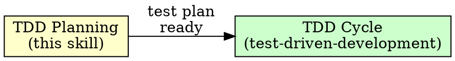

# TDD Planning Phase

## Overview

Design before you test. Answer 4 questions, produce a test plan, then hand off to Red-Green-Refactor.

**Core principle:** The best tests come from deliberate design thinking, not from jumping straight to code. Planning what to test is separate from how to test it.

## When to Use

Before the `superpowers:test-driven-development` skill kicks in — after you know WHAT to build but before you write the first test.



**Skip when:**
- Trivial one-line fix with obvious single test
- User explicitly says to skip planning

## The 4 Design Questions

Answer these before writing any test code:

### 1. What interface changes are needed?

What functions, methods, parameters, or return types will be added or modified? Define the public API surface the tests will exercise.

*Think:* "What will the caller see?"

### 2. What are the key behaviors?

List the distinct behaviors the code must exhibit — happy paths, edge cases, error conditions. Each behavior becomes a test.

*Think:* "What are all the ways this can be used, misused, or fail?"

### 3. Are the modules deep enough?

A deep module does a lot behind a simple interface. A shallow module exposes complexity to the caller. If the interface is as complex as the implementation, the design needs rethinking.

*Think:* "Is this hiding complexity or leaking it?"

### 4. How testable is this design?

If testing requires extensive mocking, global state manipulation, or complex setup — the design is too coupled. Simplify before writing tests, not after.

*Think:* "Can I test this with real objects and simple setup?"

## Output: Test Plan

After answering the 4 questions, produce a short test plan:

```
## Test Plan

**Interface:** <brief description of public API changes>

**Vertical slices** (implement in this order):
1. <simplest happy-path behavior> -> test name
2. <next behavior building on #1> -> test name
3. <edge case> -> test name
4. <error condition> -> test name
...
```

Each slice is one Red-Green-Refactor cycle. Order them so each builds on the last — simplest first, edge cases and errors after core behavior works.

## Then: Hand Off to TDD

Once the test plan exists, follow `superpowers:test-driven-development` for execution. Take the first vertical slice and enter the RED phase.

## Common Mistakes

| Mistake | Fix |
|---------|-----|
| Planning too long — analysis paralysis | Cap at 5 minutes. Aim for 3-8 slices, not exhaustive coverage. |
| Slices too large | Each slice = one test = one behavior. Split until atomic. |
| Skipping question 4 (testability) | Untestable designs waste time in RED. Catch it here. |
| Writing test code during planning | Planning produces a list, not code. Code starts in RED. |
